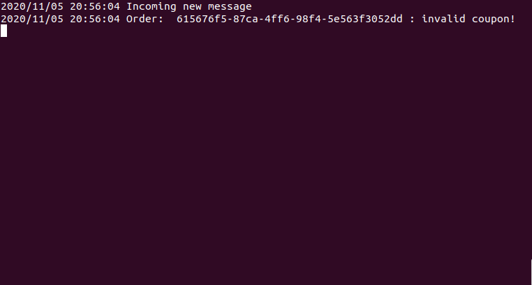

<h1 style="text-align:center">Microservices with GO Lang</h1>

Page credit cards:

 
  

Microservice Processed payment:

 
  

Microservice refusing coupon:

 
  

Microservice could not process paymet (Microservice down)

 
  

